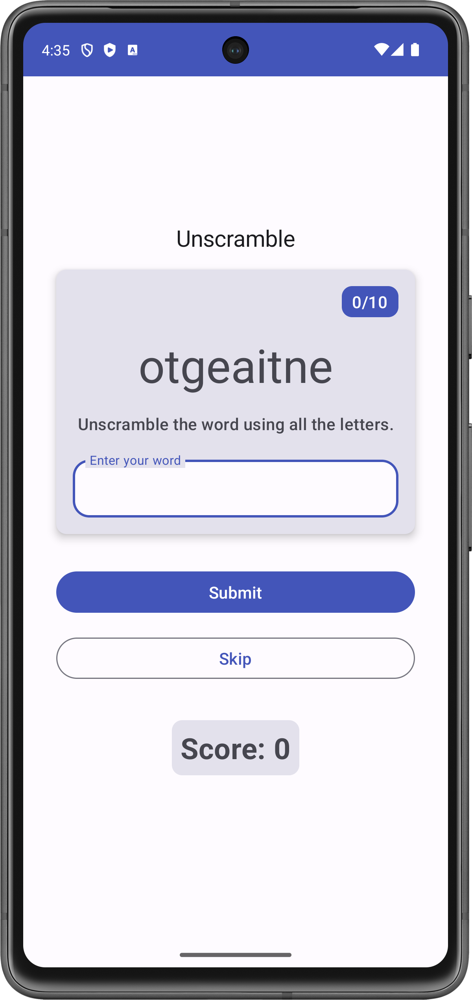
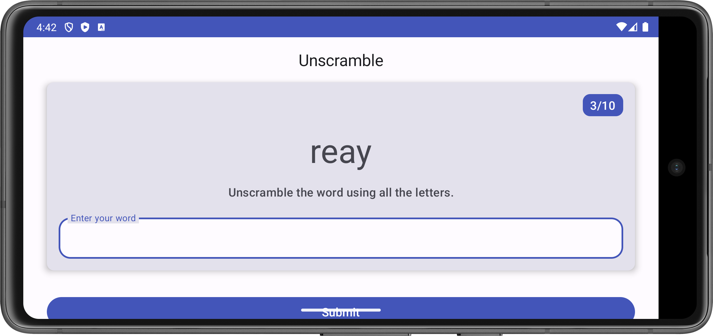
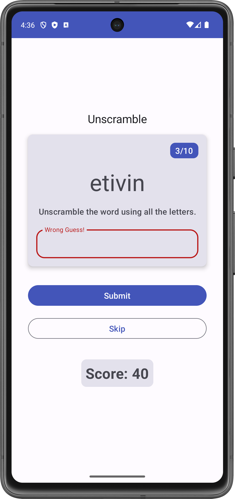

# 🎮 Unscramble App

Welcome to the **Unscramble App** 🎉! This Android game challenges users to unscramble words and rack up points as they go. The app is built using **Jetpack Compose** and leverages the **MVVM** architecture for clean, maintainable code. Let’s dive into the details below! 👇

## 🌟 Project Overview

This project was created as part of the [Android Basics in Compose](https://developer.android.com/codelabs/basic-android-kotlin-compose-viewmodel-and-state?continue=https%3A%2F%2Fdeveloper.android.com%2Fcourses%2Fpathways%2Fandroid-basics-compose-unit-4-pathway-1%23codelab-https%3A%2F%2Fdeveloper.android.com%2Fcodelabs%2Fbasic-android-kotlin-compose-viewmodel-and-state#0) codelab. It showcases modern Android development concepts, like **state management** and **UI state preservation** through **ViewModel**, ensuring a seamless experience even after configuration changes like switching from portrait to landscape.

## 🚀 Features

-   🔤 **Word Scrambling Fun**: Unscramble random words and guess the right one!
-   ⏭️ **Skip Words**: Stuck on a word? No problem, skip it and move forward.
-   📈 **Score Tracker**: Watch your score grow as you solve more words.
-   🧠 **State Preservation**: Your game state (score, word, etc.) remains intact even when rotating the screen.
-   🎮 **Game Over Dialog**: See your final score and replay or exit when the game ends.

## 🛠️ Architecture

This app follows the **MVVM (Model-View-ViewModel)** pattern for cleaner separation of concerns. Let’s break it down:

### 📦 Model Layer:

Defined in `WordsData.kt`, this layer holds the game data like:

-   List of words.
-   Constants like `MAX_NO_OF_WORDS` and `SCORE_INCREASE`.
-   Functions to unscramble words and ensure game randomness.

### 🎯 ViewModel Layer:

In `GameViewModel.kt`, this layer:

-   Manages the game logic, including scrambling words and updating the score.
-   Handles **state preservation**, ensuring that the game data remains intact after configuration changes (e.g., switching between portrait and landscape modes).

### 🎨 UI Layer:

In `GameScreen.kt`, the UI uses Jetpack Compose to create beautiful, reactive components like:

-   Text and buttons for the user interface.
-   A dynamic score display to keep track of progress.
-   Final score dialog to show when the game is over.

## ✨ Code Highlights

-   **Word Scrambling Logic**:
    -   Randomly selects and shuffles words, ensuring no two games are the same.
    -   Ensures fairness by reshuffling any word that matches the original when scrambled.
-   **State Preservation**:
    -   Uses **ViewModel** and **StateFlow** to maintain game state across orientation changes. No lost progress when you flip your device! 🔄
-   **UI Composition**:
    -   Organized using reusable composables, creating a dynamic and responsive layout.

## 📸 Screenshots *(Pixel 7 virtual device)*


 
<div align="center">

<!-- Starter Screen  -->

<p style="text-align:center;"><em>The app Main Interface.</em></p>

<!-- Landscape Mode -->

<p style="text-align:center;"><em>The app in landscape orientation.</em></p>
<!-- Alert Dialog  -->

<p style="text-align:center;"><em> Alert Dialog Box showing the final Score.</em></p>

<!-- Wrong Guess Screen  -->

<p style="text-align:center;"><em>The wrong Guess label</em></p>


</div>


## 🛠️ How to Run the Project

1.  Clone the repository:
   
   ```
    git clone https://github.com/AdityaPSingh-dev/Unscramble.git
```

2.  Open the project in **Android Studio**.
    
3.  Sync the Gradle files and run the app on an emulator or physical device.
    

## 📜 License and Starter Code

This project uses the **Apache 2.0** license 📝.

**Note**: The starter code was provided by the **Android Open Source Project** and is licensed under their terms. You can check out the starter code here 👉 [Google Developer Training - Unscramble App Starter Code](https://github.com/google-developer-training/basic-android-kotlin-compose-training-unscramble/tree/starter).
